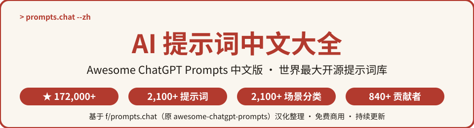
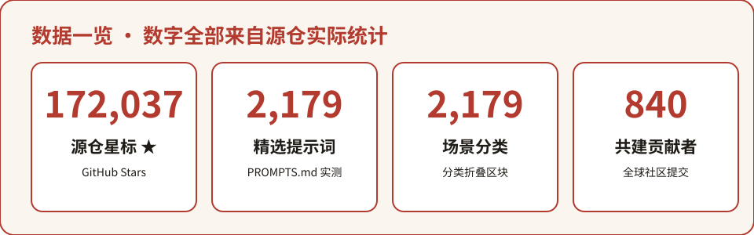
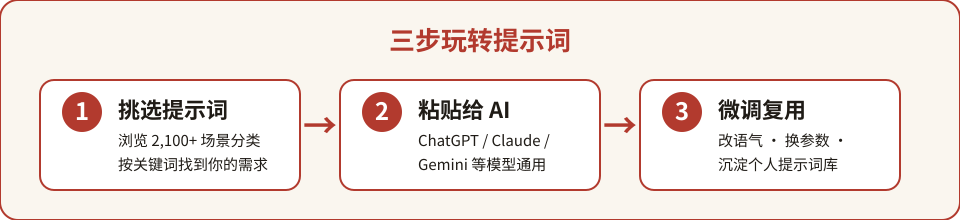

<p align="center">
  
</p>

# Awesome ChatGPT Prompts 中文版

> **世界最大开源 AI 提示词库 · 中文精选版**
> 源自 GitHub 上 **172,000+ ★** 的 [f/prompts.chat](https://github.com/f/prompts.chat)（原名 awesome-chatgpt-prompts），收录 **2,179 条精选提示词**、覆盖 **2,179 个场景分类**，由 **840 位全球贡献者** 共同建设。


---

⭐ 如果对你有帮助，点个 Star 支持中文开源

## 目录

- [这是什么？](#这是什么)
- [为什么值得收藏](#为什么值得收藏)
- [数据一览](#数据一览)
- [快速开始](#快速开始)
- [分类清单](#分类清单)
- [中文精选翻译](#中文精选翻译)
- [完整数据](#完整数据)
- [常见问题 FAQ](#常见问题-faq)
- [参与贡献](#参与贡献)
- [致谢](#致谢)
- [许可声明](#许可声明)

---

## 这是什么？

**Awesome ChatGPT Prompts 中文版** 是对全球最受欢迎的开源提示词库 [prompts.chat](https://prompts.chat)（原名 *Awesome ChatGPT Prompts*）的中文二次开发项目。

源项目于 2022 年 12 月发布，是全球**第一个**提示词库，曾被 [Forbes](https://www.forbes.com/sites/tjmccue/2023/01/19/chatgpt-success-completely-depends-on-your-prompt/) 专题报道，被 [Harvard](https://www.huit.harvard.edu/news/ai-prompts)、[Columbia](https://etc.cuit.columbia.edu/news/columbia-prompt-library-effective-academic-ai-use) 等高校引用，获得 40+ 篇学术论文引用，并被 OpenAI 联合创始人 Greg Brockman、Hugging Face CEO Clement Delangue、前 GitHub CEO Thomas Dohmke 等业界大牛公开推荐。

这些提示词（Prompts）**不仅适用于 ChatGPT**，同样适用于 Claude、Gemini、Llama、Mistral 等主流 AI 模型——把提示词粘贴进对话，即可让 AI 化身终端、面试官、编剧、健身教练……

**中文版做了什么：**
- 📝 精选 **40 条高频提示词** 提供**中文对照翻译**（见 [categories.md](categories.md)），降低中文用户上手门槛；
- 🗂️ 整理 2,179 个场景分类的中文索引，方便按需查找；
- 📖 提炼使用方法、微调技巧与 FAQ，让提示词真正"用得起来"。

## 为什么值得收藏

- 🌍 **全球体量第一**：2,179 条提示词、2,179 个分类，写作、编程、职场、学习、生活、创意全覆盖；
- 🆓 **免费可商用**：提示词内容采用 CC0 公有领域许可，随便拿去用；
- 🔄 **跨模型通用**：ChatGPT / Claude / Gemini / Llama / Mistral 通吃；
- 🚀 **持续更新**：社区每时每刻都在提交新提示词，仓库保持活跃；
- 🇨🇳 **中文友好**：精选翻译 + 中文分类索引，英文零基础也能直接用。

## 数据一览

<p align="center">
  
</p>

> 数字全部来自源仓 [PROMPTS.md](https://raw.githubusercontent.com/f/prompts.chat/main/PROMPTS.md) 实际抓取统计（2026-10 实测）。

## 快速开始

### 三步上手

<p align="center">
  
</p>

1. **挑选提示词**：在下方分类清单中，按场景找到你需要的提示词；
2. **粘贴给 AI**：把提示词（英文原文或中文翻译均可）复制到 ChatGPT / Claude / Gemini 对话框；
3. **微调复用**：把提示词里的 `角色`、`任务`、`约束` 改成你自己的需求，存进个人模板库反复使用。

### 示例一：让 AI 变身 Linux 终端

```text
请扮演一个 Linux 终端。我会输入命令，你只需回复终端应该显示的内容，
且仅放在一个独立的代码块里，不要写任何解释。我的第一个命令是：pwd
```

### 示例二：让 AI 化身面试官

```text
请扮演一名面试官。我是应聘者，你针对「软件工程师」岗位向我提问。
每次只问一个问题，等我回答后再问下一个，不要一次抛出全部问题，也不要写解释。
```

### 示例三：英语翻译润色

```text
请扮演一名英语翻译、拼写校对与润色专家。我会用任何语言与你对话，
你负责识别语言、翻译并用更优美高级的英语重写我的句子，保持原意。
只输出润色结果，不要写解释。
```

> 更多示例与中英对照，见 [categories.md](categories.md)。

## 分类清单

精选 24 个高频场景分类（完整 2,179 个分类见源仓 PROMPTS.md）：

| 中文分类 | 英文原名 | 一句话用途 |
| --- | --- | --- |
| Linux 终端 | Linux Terminal | 让 AI 模拟终端执行命令并输出结果 |
| 英语翻译润色 | English Translator and Improver | 多语翻译 + 地道英语润色 |
| 面试官 | Job Interviewer | 模拟岗位面试，逐题问答 |
| JavaScript 控制台 | JavaScript Console | 模拟 JS 控制台输出 |
| Excel 表格 | Excel Sheet | 纯文本 Excel，可执行公式 |
| 英语发音助手 | English Pronunciation Helper | 用母语字母标注英文发音 |
| 口语教练 | Spoken English Teacher and Improver | 陪练口语 + 严格纠错 |
| 旅行导游 | Travel Guide | 按位置推荐周边景点 |
| 查重助手 | Plagiarism Checker | 判断文本是否被查重系统检出 |
| 角色扮演 | Character | 扮演任意角色或剧集人物 |
| 广告策划 | Advertiser | 策划产品推广 campaign |
| 故事大王 | Storyteller | 创作引人入胜的故事 |
| 足球解说 | Football Commentator | 对进行中的比赛实时解说 |
| 脱口秀演员 | Stand-up Comedian | 基于时事创作幽默段子 |
| 励志教练 | Motivational Coach | 给出达成目标的具体策略 |
| 编剧 | Screenwriter | 创作电影 / 网剧剧本 |
| 小说家 | Novelist | 创作长篇小说 |
| 影评人 | Movie Critic | 撰写深度电影评论 |
| 情感教练 | Relationship Coach | 调解关系冲突 |
| 诗人 | Poet | 创作打动人心的诗歌 |
| 哲学老师 | Philosophy Teacher | 通俗讲解哲学概念 |
| 数学老师 | Math Teacher | 讲解数学公式与解题思路 |
| 网络安全专家 | Cyber Security Specialist | 制定数据防护策略 |
| 私人教练 | Personal Trainer | 定制健身与减脂计划 |

## 中文精选翻译

📄 **[categories.md](categories.md)** — 收录 40 条最常用提示词的**中英对照翻译**，每条包含中文译文 + 英文原文 + 原作者署名，复制即用。

## 完整数据

- 📄 源仓全量提示词（2,179 条）：[PROMPTS.md](https://raw.githubusercontent.com/f/prompts.chat/main/PROMPTS.md)
- 🌐 在线浏览与提交：[prompts.chat](https://prompts.chat/prompts)
- 🤗 Hugging Face 数据集（全站最受欢迎数据集）：[fka/prompts.chat](https://huggingface.co/datasets/fka/prompts.chat)
- 📊 数据格式：`prompts.csv`（源仓根目录）

## 常见问题 FAQ

**Q1：提示词为什么大多是英文的？**
源库以英文为主。本项目已在 [categories.md](categories.md) 提供 40 条高频提示词的中文翻译；其余英文提示词直接粘贴即可使用——主流 AI 模型完全能理解英文指令。

**Q2：需要付费吗？可以商用吗？**
完全免费。源项目对提示词内容采用 **CC0 公有领域** 授权，可自由使用、修改、商用；本仓库代码部分采用 MIT 许可。详见 [THIRD_PARTY_NOTICES.md](THIRD_PARTY_NOTICES.md)。

**Q3：怎么用效果最好？**
① 先明确你要 AI 扮演的角色；② 把任务拆成"背景 + 目标 + 约束 + 输出格式"；③ 效果不满意就迭代修改提示词，而不是换一个问题重来。

**Q4：可以自己提交提示词吗？**
可以。源项目在 [prompts.chat/prompts/new](https://prompts.chat/prompts/new) 提交后会自动同步；本仓库也欢迎 PR 补充中文翻译。

**Q5：这个仓库和"AI 工具导航"类仓库有什么区别？**
AI 工具导航帮你"找工具"，本仓库给你"直接用"的提示词——复制粘贴即可让 AI 干活，不需要安装任何东西。

## 参与贡献

- 🐛 发现翻译错误或分类错误：提 Issue；
- 🌐 补充提示词中文翻译：Fork 后修改 [categories.md](categories.md) 提 PR；
- 📝 分享你的微调经验：欢迎在 README 或 Issue 中讨论。

## 致谢

- 特别感谢 **f**（源项目作者）与 **840 位贡献者** 共建的 [f/prompts.chat](https://github.com/f/prompts.chat)；
- 感谢 Forbes、Harvard、Columbia 的报道与引用；
- 感谢 Greg Brockman、Wojciech Zaremba、Clement Delangue、Thomas Dohmke 的公开推荐；
- 感谢每一位给本仓库 Star 的你 🌟

## 许可声明

- 本仓库代码与文档：**MIT License**（见 [LICENSE](LICENSE)）；
- 源项目 [f/prompts.chat](https://github.com/f/prompts.chat)：代码 MIT License，提示词内容 CC0 1.0 公有领域；
- 第三方声明与完整署名见 [THIRD_PARTY_NOTICES.md](THIRD_PARTY_NOTICES.md)。


## 姊妹项目

中文开源矩阵，一网打尽开发者的知识库：

- [zhskills · 中文技能库](https://github.com/zieang88888/zhskills)
- [awesome-ai-tools-zh · AI 工具导航](https://github.com/zieang88888/awesome-ai-tools-zh)
- [free-programming-books-zh · 编程书籍大全](https://github.com/zieang88888/free-programming-books-zh)
- [system-design-zh · 系统设计面试](https://github.com/zieang88888/system-design-zh)
- [awesome-python-zh · Python 生态导航](https://github.com/zieang88888/awesome-python-zh)
- [ohmyzsh-zh · 终端效率神器](https://github.com/zieang88888/ohmyzsh-zh)
- [llm-course-zh · LLM 课程导航](https://github.com/zieang88888/llm-course-zh)
- [design-resources-for-developers-zh · 设计资源大全](https://github.com/zieang88888/design-resources-for-developers-zh)
